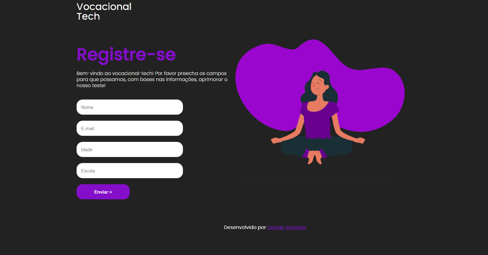
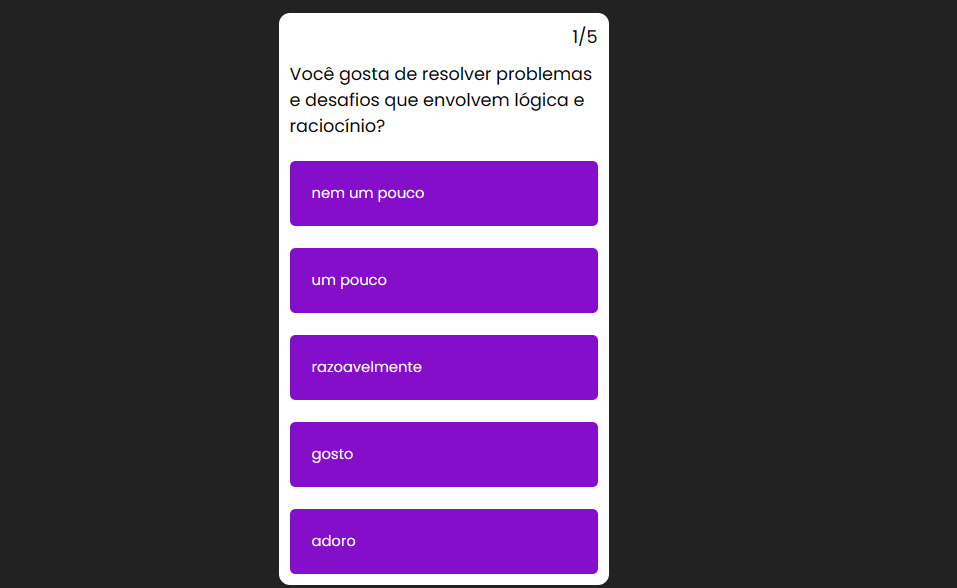
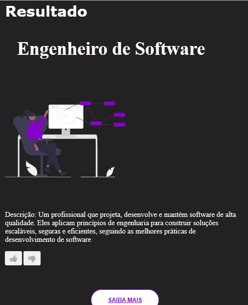

# VOCACIONAL TECH

Site que recebe respostas relacionadas ao perfil do usuário, e atráves de Machine Learning, retorna uma área, baseadas na aptidões do usuario, como sugestão.

# Tecnologias utilizadas
- ``Flask``
- ``Python``
-  ``Javascript``
- ``HTML``
- ``CSS``

# Tela de cadastro:

A aplicação  necessita dos cadastros dos dados básicos dos usuários, a fim de ter uma melhor análise dos resultados. A tabela usuário está arranjada da seguinte forma:

| Id       | Nome     | E-mail       | Idade  | Escola               |
|-------------|----------|--------------|----------|---------------------------|
| Serial primary Key     | Varchar(100)   | Varchar(255)    | Integer| Varchar(100) |

# Tela de perguntas:

O site, após a inserção dos dados, permite a respostas de pergutnas chaves que serão chaves para a definição da profissão. No sistema, é guardada as respostas, a fim de analisar os resultados para aprimorar, futuramente, o teste!

| Id _usuario      | pergunta1     | pergunta2     | pergunta3  | pergunta4 | pergunta5 | profissao |
|-------------|----------|--------------|-------------|----------|---------------------------|---------------------------|
| Serial primary Key     | Varchar(10)   | Varchar(10)    | Integer| Varchar(10) | Varchar(10) | Varchar(10)|

# Processamento das respostas:

O Processamento das respostas são feitos através de um campo da IA - Machine Learning - usando árvores de decisão, que usa de uma tabela com possiveis predições para possiveis respostas. Porém, nem todas as possibilidades são satisfieta nessa tabela, aí que surge o Machine Learning, para retornar um resultado que não foi previsto na tabela, porém o resultado será aquele que dá mais "match" com a das definidas na tabela. Veja a tabela:

| pergunta1     | pergunta2 | pergunta3 | pergunta4     | pergunta5     | profissao                |
|---------------|-----------|-----------|---------------|---------------|--------------------------|
| Razoavelmente | Ruim      | Mediana   | Pesquisa      | Enigma        | Desenvolvedor Back-end  |
| Gosto         | Pessima   | Ruim      | Pesquisa      | Enigma        | Desenvolvedor Back-end  |
| Adoro         | Mediana   | Pessima   | Apresentar    | Enigma        | Desenvolvedor Back-end  |
| Upouco        | Otima     | Ruim      | Estilizar     | Pintar        | Desenvolvedor Front-end |
| Razoavelmente | Boa       | Pessima   | Estilizar     | Pintar        | Desenvolvedor Front-end |
| Razoavelmente | Otima     | Mediana   | Estilizar     | Pintar        | Desenvolvedor Front-end |
| Razoavelmente | Otima     | Ruim      | Estilizar     | Enigma        | Desenvolvedor Fullstack |
| Gosto         | Boa       | Mediana   | Pesquisa      | Pintar        | Desenvolvedor Fullstack |
| Adoro         | Otima     | Mediana   | Pesquisa      | Enigma        | Desenvolvedor Fullstack |
| Razoavelmente | Mediana   | Mediana   | Pesquisa      | Grafico       | Profissional de Dados   |
| Upouco        | Ruim      | Ruim      | Pesquisa      | Grafico       | Profissional de Dados   |
| Adoro         | Mediana   | Pessima   | Apresentar    | Grafico       | Profissional de Dados   |
| Razoavelmente | Mediana   | Boa       | Pesquisa      | Resumo        | Analista de Sistemas    |
| Upouco        | Ruim      | Otima     | Pesquisa      | Grafico       | Analista de Sistemas    |
| Npouco        | Mediana   | Otima     | Apresentar    | Resumo        | Analista de Sistemas    |
| Razoavelmente | Mediana   | Razoavelmente | Liderar    | Enigma        | Engenheiro de Software  |
| Boa           | Ruim      | Ruim      | Liderar       | Resumo        | Engenheiro de Software  |
| Upouco        | Pessima   | Boa       | Liderar       | Grafico       | Engenheiro de Software  |

Exemplo de situação que usa a arvores de decisão não tem uma trilha especificada na tabela, fanzendo necessário o uso das predições do Machine Learning:

| Pergunta     | Resposta           |
|--------------|--------------------|
| Pergunta1    | Adoro              |
| Pergunta2    | Boa                |
| Pergunta3    | Otima              |
| Pergunta4    | Apresentar         |
| Pergunta5    | Grafico            |
| Profissão    | Desenvolvedor Fullstack  |

 # Tela de  resultado

 será apresentado sempre uma tela padrão para todos os resultados, porém muda algumas váriaveis:

 - Nome do resultado
 - Animação
 - Descrição
 - link de saiba mais

 

 # Tela de  resultado - Opção de opinar sobre o teste

 

O usuário ao chegar na tela de resultado poderá dá like ou dislike, tais valores também são armazenados no Banco de dados. Os dados estão especificados da seguinte forma:

| id_usuario     | opiniao           |
|--------------|--------------------|
| Integer    | Varchar(10)              |

 

### Autor
---

Feito com ❤️ por Darlan Almeida👋🏽 Entre em contato!

 

